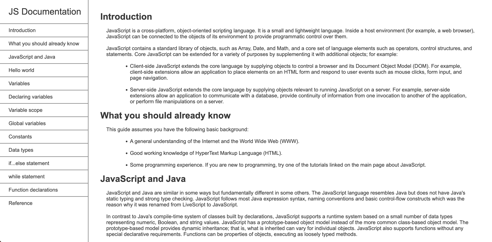

# freeCodeCamp - Technical Documentation solution

This is a solution to the [Technical Documenation on freeCodeCamp]([https://www.frontendmentor.io/challenges/qr-code-component-iux_sIO_H](https://www.freecodecamp.org/learn/2022/responsive-web-design/#build-a-technical-documentation-page-project)).


## Table of contents

- [Overview](#overview)
  - [Screenshot](#screenshot)
  - [Links](#links)
- [My process](#my-process)
  - [Built with](#built-with)
  - [What I learned](#what-i-learned)
  - [Continued development](#continued-development)


## Overview

Build a technical documentation application using Flexbox, pseudo-classes, fixed position elements, pseudo-elements, median queries and more. I attempted to recreate the original provided [solution](https://technical-documentation-page.freecodecamp.rocks/) provided by freeCodeCamp.


### Screenshot




### Links

- Solution URL: [View Code in GitHub](https://github.com/14thommi/frontend-mentor-qr-code-component)
- Live Site URL: [View Live Site](https://14thommi.github.io/frontend-mentor-qr-code-component/)


## My process

### Built with

- Semantic HTML5 markup
- CSS custom properties
- Flexbox
- CSS Grid
- Styles
  - Font family: [Outfit](https://fonts.google.com/specimen/Outfit) by On Brand Investment Pty Ltd, Rodrigo Fuenzalida


### What I learned

I learned how to fix an element to the bottom of a screen and have the element appear centered. Because a DIV is aligned from its position at the top and left edge, the element will not appear center unless you add `transform: translate(-50%, -50%);` which will make the alignement edge  of the DIV at its center.


```html
  <div class="attribution">
    ...
  </div>
```
```css
.attribution {
    position: fixed;
    bottom: 2rem;
    left: 50%;
    /* transform then translate ensures the element is not aligned with the left of the DIV at (left 50%) but instead the center of the DIV */
    transform: translate(-50%, -50%);
    margin: 0 auto;
}
```


### Continued development

My primary goal right now is to get comfortable with using HTML and CSS basics so I will feel like my core skills in HTML and CSS will not be forgotten after a brief period devoted to studying JS. 
